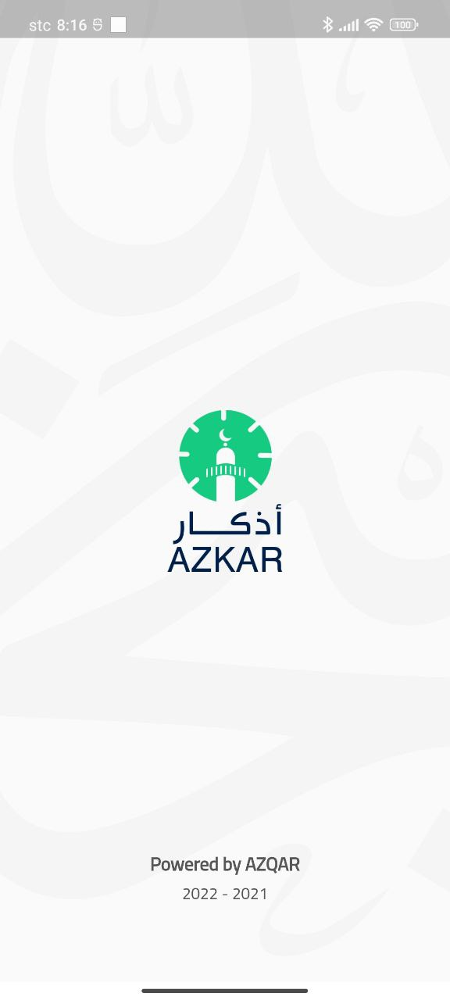

# Azkar - Mobile App 

Azkar is Muslims App that allows you to remember the Zikr of allah by allowing you to set a periodic Alaram for every
Zikr that you wish to be reminded of.

Azkar is available on the Google Play Store.

## About

Azkar is Muslims App that allows you to remember the Zikr of allah by allowing you to set a periodic Alaram for every
Zikr that you wish to be reminded of.

## Features

The android app lets you:
- Showing Prayer times.
- Display Azkar List.
- Enable and disable Alarm about a Selected Zikr.
- Notifications on special religious events such as Eid and Special days.

## Screenshots

## Permissions

On Android versions prior to Android 6.0, Azkar requires the following permissions:
- Full Network Access.
- Location access to get accurate Prayer times.

## Contributing

Azkar app is a free and open source project developed by volunteers. Any contributions are welcome. Here are a few ways you can help:
 * [Report bugs and make suggestions.](https://github.com/wdelawed/azqarApp/issues)
 * Write some code. Please follow the code style used in the project to make a review process faster.

## License

This application is released under GNU GPLv3 (see [LICENSE](LICENSE)).
Some of the used libraries are released under different licenses.
